# Soccer Game Day Notifications / Sports Alerts System

## **Project Overview**

This project focuses on building an alert system that delivers real-time **EPL & EPL** soccer game day score notifications to users through SMS and email. It utilizes key AWS services such as **Amazon SNS** for messaging, **AWS Lambda** for serverless computation using **Python**, and **Amazon EventBridge** for event-driven architecture. Additionally, it integrates **soccer APIs** to fetch live game data, ensuring sports enthusiasts stay updated on the latest match information. This project highlights practical cloud computing concepts and implements efficient notification workflows.

---

## **Features**
- Fetches live soccer game scores using an external API.
- Sends formatted score updates to subscribers via SMS/Email using Amazon SNS.
- Scheduled automation for regular updates using Amazon EventBridge.
- Designed with security in mind, following the principle of least privilege for IAM roles.

## **Prerequisites**
- Free account with subscription and API Key at [sportsdata.io](https://sportsdata.io/)
- Personal AWS account with basic understanding of AWS and Python

---

## **Technical Architecture**
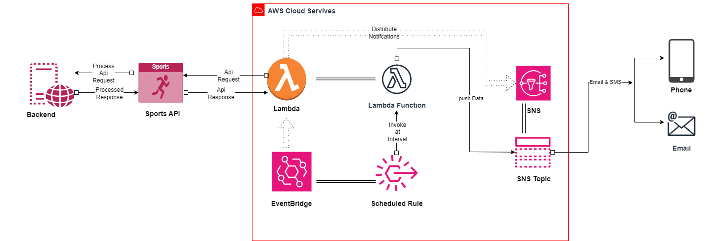

---

## **Technologies**
- **Cloud Provider**: AWS
- **Core Services**: SNS, Lambda, EventBridge
- **External API**: Soccer Game API (SportsData.io)
- **Programming Language**: Python 3.x
- **IAM Security**:
  - Least privilege policies for Lambda, SNS, and EventBridge.

---

## **Project Structure**

### Requirements

| Name | Version |
|------|---------|
| <a name="requirement_terraform"></a> [terraform](#requirement\_terraform) | >= 1.7.0 |
| <a name="requirement_aws"></a> [aws](#requirement\_aws) | >= 4.66, < 5.67.0 |

### Providers

| Name | Version |
|------|---------|
| <a name="provider_archive"></a> [archive](#provider\_archive) | 2.7.0 |
| <a name="provider_aws"></a> [aws](#provider\_aws) | 5.66.0 |

### Modules

No modules.

### Resources

| Name | Type |
|------|------|
| [aws_cloudwatch_event_rule.schedule_rule](https://registry.terraform.io/providers/hashicorp/aws/latest/docs/resources/cloudwatch_event_rule) | resource |
| [aws_cloudwatch_event_target.lambda_target](https://registry.terraform.io/providers/hashicorp/aws/latest/docs/resources/cloudwatch_event_target) | resource |
| [aws_iam_policy.sns_publish_policy](https://registry.terraform.io/providers/hashicorp/aws/latest/docs/resources/iam_policy) | resource |
| [aws_iam_role.soccer_role](https://registry.terraform.io/providers/hashicorp/aws/latest/docs/resources/iam_role) | resource |
| [aws_iam_role_policy_attachment.attach_lambda_basic_execution](https://registry.terraform.io/providers/hashicorp/aws/latest/docs/resources/iam_role_policy_attachment) | resource |
| [aws_iam_role_policy_attachment.attach_sns_publish_policy](https://registry.terraform.io/providers/hashicorp/aws/latest/docs/resources/iam_role_policy_attachment) | resource |
| [aws_lambda_function.soccer_notifications](https://registry.terraform.io/providers/hashicorp/aws/latest/docs/resources/lambda_function) | resource |
| [aws_lambda_permission.allow_eventbridge](https://registry.terraform.io/providers/hashicorp/aws/latest/docs/resources/lambda_permission) | resource |
| [aws_sns_topic.soccer_topic](https://registry.terraform.io/providers/hashicorp/aws/latest/docs/resources/sns_topic) | resource |
| [aws_sns_topic_subscription.email_subscription](https://registry.terraform.io/providers/hashicorp/aws/latest/docs/resources/sns_topic_subscription) | resource |
| [aws_sns_topic_subscription.sms_subscription](https://registry.terraform.io/providers/hashicorp/aws/latest/docs/resources/sns_topic_subscription) | resource |
| [archive_file.lambda](https://registry.terraform.io/providers/hashicorp/archive/latest/docs/data-sources/file) | data source |
| [aws_caller_identity.current](https://registry.terraform.io/providers/hashicorp/aws/latest/docs/data-sources/caller_identity) | data source |

### Inputs

| Name | Description | Type | Default | Required |
|------|-------------|------|---------|:--------:|
| <a name="input_soccer_api_key"></a> [soccer\_api\_key](#input\_soccer\_api\_key) | actual SOCCER API key | `string` | `""` | no |

### Outputs

| Name | Description |
|------|-------------|
| <a name="output_eventbridge_rule_arn"></a> [eventbridge\_rule\_arn](#output\_eventbridge\_rule\_arn) | ARN of the EventBridge Rule |
| <a name="output_eventbridge_target_id"></a> [eventbridge\_target\_id](#output\_eventbridge\_target\_id) | ID of the EventBridge Target |
| <a name="output_iam_role_arn"></a> [iam\_role\_arn](#output\_iam\_role\_arn) | ARN of the IAM Role for Lambda |
| <a name="output_lambda_function_arn"></a> [lambda\_function\_arn](#output\_lambda\_function\_arn) | ARN of the Lambda Function |
| <a name="output_lambda_function_name"></a> [lambda\_function\_name](#output\_lambda\_function\_name) | Name of the Lambda Function |
| <a name="output_sns_email_subscription"></a> [sns\_email\_subscription](#output\_sns\_email\_subscription) | ARN of the email subscription to the SNS Topic |
| <a name="output_sns_publish_policy_arn"></a> [sns\_publish\_policy\_arn](#output\_sns\_publish\_policy\_arn) | ARN of the SNS Publish Policy |
| <a name="output_sns_sms_subscription"></a> [sns\_sms\_subscription](#output\_sns\_sms\_subscription) | ARN of the SMS subscription to the SNS Topic |
| <a name="output_sns_topic_arn"></a> [sns\_topic\_arn](#output\_sns\_topic\_arn) | ARN of the SNS Topic |


# **Next Steps to Set Up and Run the Project**

Follow these steps to configure, deploy, and run the Soccer Game Day Notifications system.

---

## **Step 1: Set Up the Environment**

### Prerequisites

1. **AWS Account**:

Ensure you have an active AWS account.

---
2. **AWS CLI**:

Install and configure the AWS CLI. Run the following commands to check:

```bash
   aws --version
```
---

3. **Terraform**:

Ensure Terraform is installed and updated to the required version (>= 1.7.0).

```bash
terraform --version
```
---

4. **Clone the Repository** :

 I am using vscode for this project

```bash
git clone https://github.com/lnformbu/realTime-soccer-updates.git
cd realTime-soccer-updates
```

---
5. **Install Terraform Modules**

Navigate to the terraform directory and initialize the modules

``` bash
cd terraform
terraform init
```
---
6. **Set Up API Key**

If you're using Terraform Cloud like me as the backend for your state file, store the API key securely as a variable. Here’s how you might reference it in your code.

```hcl
soccer_api_key = var.soccer_api_key

```

##### Security Best Practice
It is not recommended to hardcode sensitive information, such as API keys, directly in your codebase. Instead, use secure practices like Terraform Cloud variables, environment variables, or a secrets manager to manage and protect sensitive data. 

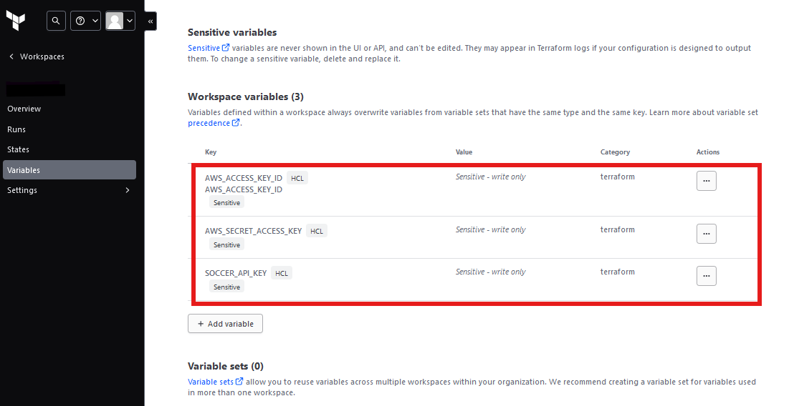

---

7. **Deploy Infrastructure**

To deploy the required AWS resources, execute the following Terraform commands:

#### **Plan Deployment**
Run the `terraform plan` command to preview the resources that Terraform will create:

```bash
terraform plan
```

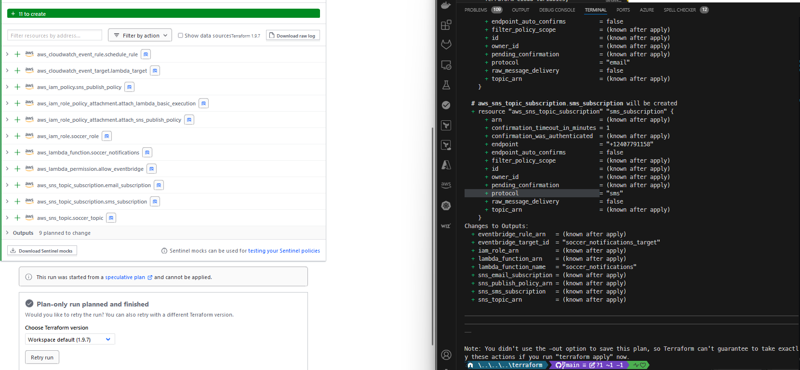

```bash
terraform apply 
```

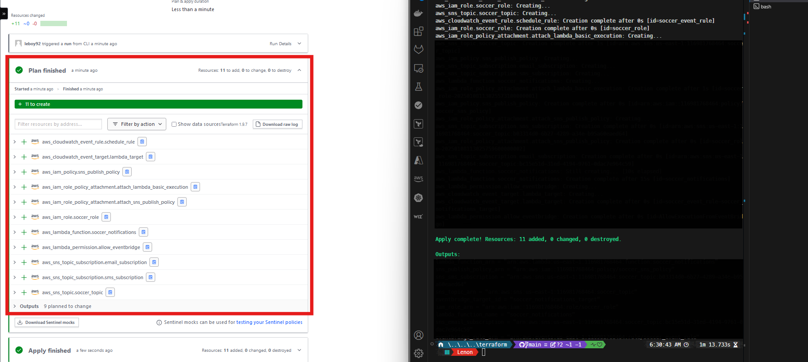

---
# resources are deployed.

check the console to make sure all works as intended and you are able to get emails and messages. 

#### **Confirm The SNS Topic**

1. Open the AWS Management Console.
2. Navigate to the SNS service.
3. Click  Topics
**You should see the following below**
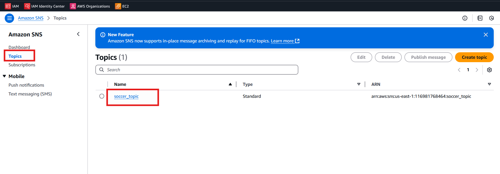


#### **Add Subscriptions to the SNS Topic**

1. After confirm the topichas been created
2. Click Subscription.

**You should see the following below**
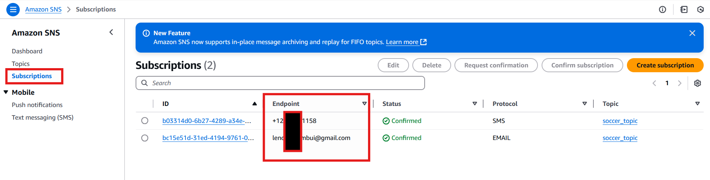

**Confirm Subscriptions**

>> **Email Subscription**

1. Check the inbox of the email address you used for the subscription.
2. Look for an email from AWS SNS with the subject "AWS Notification - Subscription Confirmation."
3. Open the email and click on the **confirmation link** to activate the subscription.

>> **SMS Subscription**

- For SMS subscriptions, no confirmation is required. The subscription will be active immediately after creation. Make sure to test both email and SMS notifications by triggering the system to confirm everything is functioning correctly.


#### **Create the SNS Publish Policy**

1. Open the IAM service in the AWS Management Console.
2. Check if the policy has been created

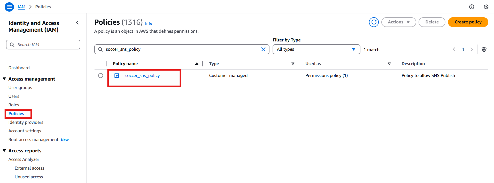


#### **Create an IAM Role for Lambda**
1. Open the IAM service in the AWS Management Console.
2. Click Roles → Create Role.
3. Select AWS Service and choose Lambda.

**You should see the following below**
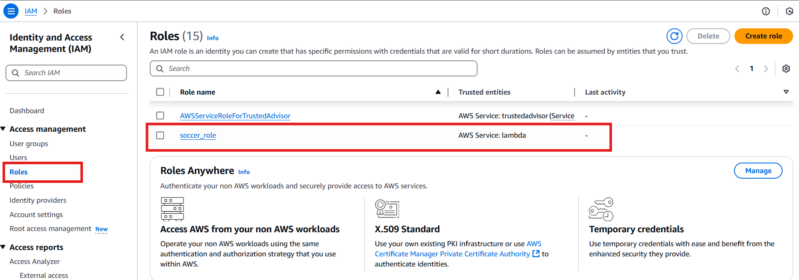


### **Deploy the Lambda Function**
1. Open the AWS Management Console and navigate to the Lambda service.
2. Click on Function → soccer_notifications

3. Under the Function select → Code section:
   - Double check if the file  `lambda_function.py` exist.
   - if not create it → copy and Paste the contents of `lambda_function.py` into the inline code editor.

**You should see the following below**
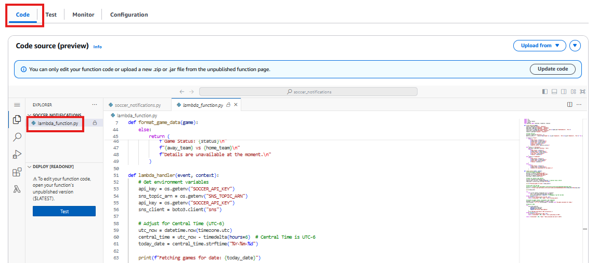

8. Under the Environment Variables section, verify the following are populated:
   - `SOCCER_API_KEY`: your soccer API key. 
   >`copy and paste your key here`
   - `SNS_TOPIC_ARN`: the ARN of the SNS topic created earlier. 
   >`This should be populated`.
   - `COMPETITIONS` : should be `MLS`

**You should see the following below**
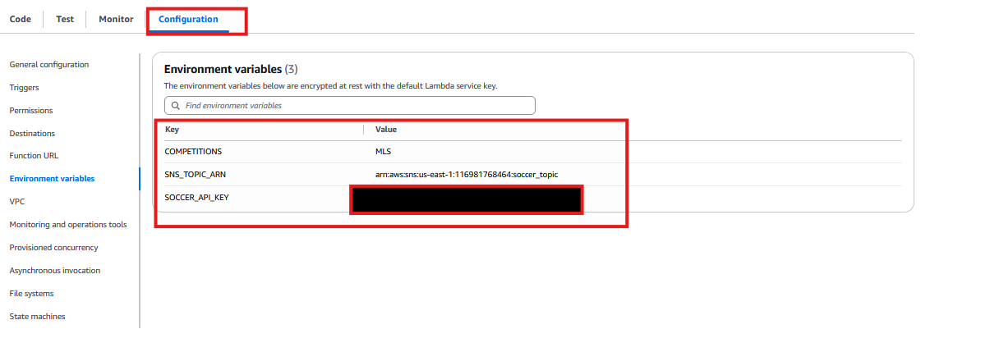


### **Set Up Automation with EventBridge**
1. Navigate to the EventBridge service in the AWS Management Console.
2. Go to Rules → check if rules are created

**You should see the following below**
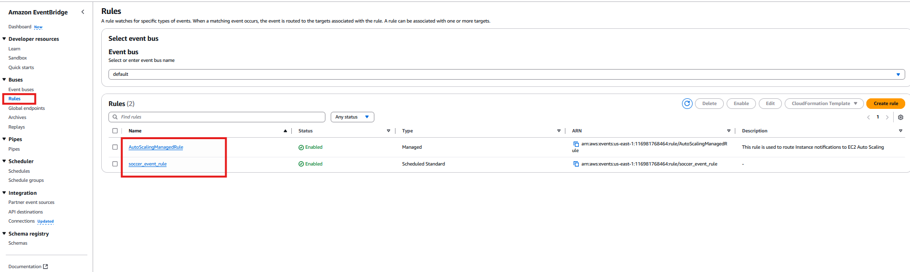


### **Test the System**
1. Open the Lambda function in the AWS Management Console.
2. Create a test event to simulate execution.

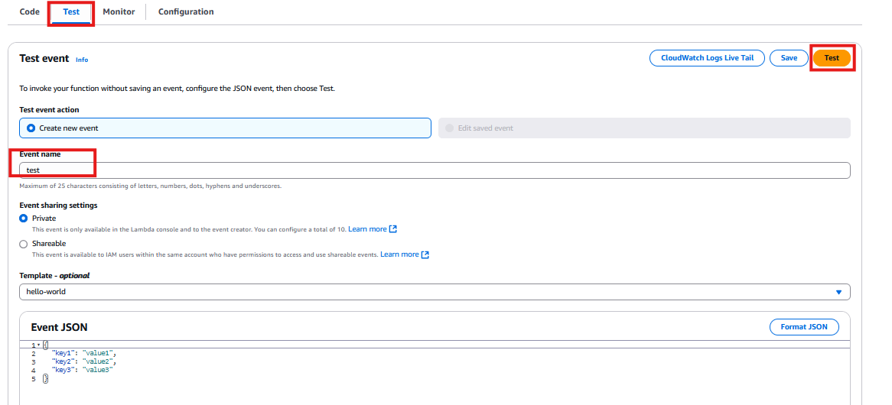

3. Run the function and check CloudWatch Logs for errors.

**You should see success as below**
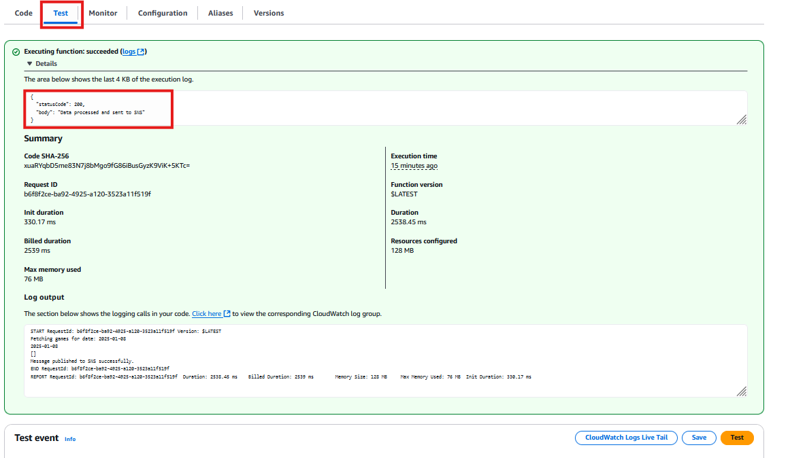


**You should see cloudwatch logs as below**
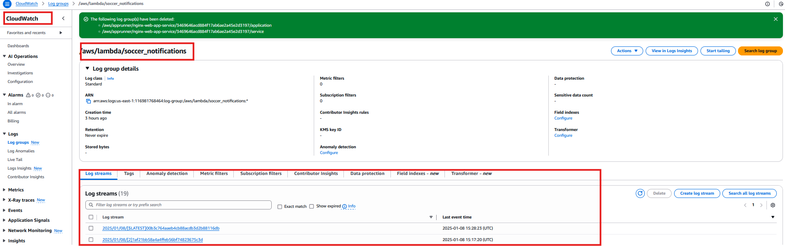


4. Verify that SMS notifications are sent to the subscribed users.

**Check your email**
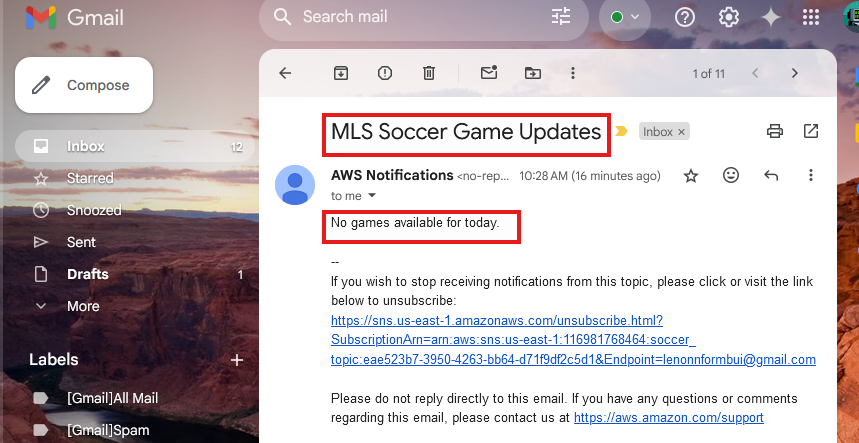

---

### **Destroy Your Infrastructure**

To remove all the resources created during deployment and avoid incurring further charges, follow these steps:

1. **Navigate to the Terraform Directory**:
 ```bash
   cd terraform
```
2. **Run the Destroy Command**:
Execute the following command to destroy the infrastructure

```bash
terraform destroy -auto-approve
```
> **NEVER USE IN PROD**
Caution: Be careful when using -auto-approve as it will immediately destroy all resources without requiring confirmation.


3. **Verify Cleanup**:

Check the AWS Management Console to ensure all resources have been successfully deleted


----
>> -

# 🎉🎊 **Congratulations on Completing the Lab!** 🎊🎉

You’ve successfully navigated through the setup, deployment, and operation of the **Soccer Game Day Notifications System**! 🚀⚽

>> -
---

## **What We Learned** 🏆

#### **1. Designing a Notification System**
- Learned how to build a robust notification system by integrating **AWS SNS** and **AWS Lambda**.
- Leveraged SNS to send notifications via email and SMS, while Lambda handled serverless execution logic.

#### **2. Securing AWS Services**
- Gained experience in applying **least privilege IAM policies** to enhance the security of AWS resources.
- Ensured each service (Lambda, SNS, EventBridge) had only the permissions necessary to perform its tasks.

#### **3. Automating Workflows**
- Used **Amazon EventBridge** to automate and schedule workflows, enabling timely and consistent delivery of notifications without manual intervention.

#### **4. API Integration**
- Explored how to integrate external APIs, such as the **Soccer API**, into cloud-based architectures.
- Processed real-time game data from external services to generate meaningful notifications for end users.

---

## **You’re a Cloud Superstar!** 🌟
🌐 Welcome to the world of cloud architecture mastery.  
📩 SMS, 📧 emails, and ⚡ automated workflows—you're unstoppable now!  

🎉 Keep building, innovating, and exploring! The sky’s the limit. 🚀🌌  

